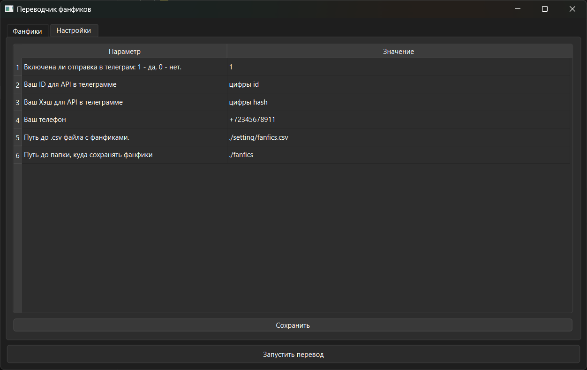
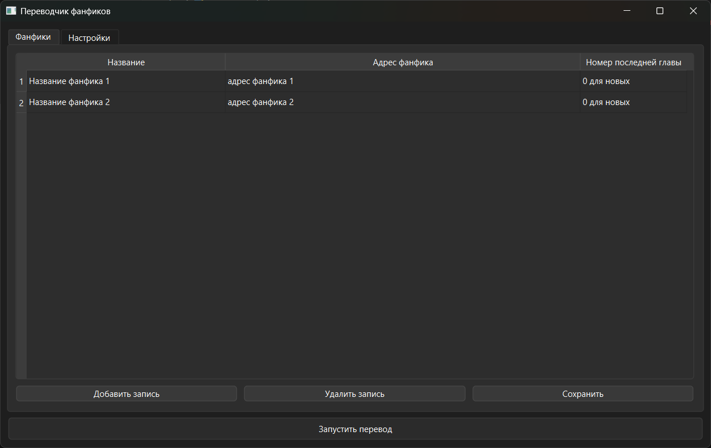

# Fanfic monitor and translator

**Fanfic monitor and translator** - программа на Python для отслеживания новых глав на SpaceBattles и SufficientVelocity (пока только на них), создания файла из переведенных и отправки его в Ваш телеграм в Избранное.

---

## Оглавление

- [Подготовка](#подготовка)
  - [Скачивание и установка библиотек](#скачивание-и-установка-библиотек)
  - [Получение ключей для Telegram](#получение-ключей-для-telegram)
- [Версия с графическим интерфейсом](#версия-с-графическим-интерфейсом)
  - [Запуск](#запуск)
  - [Настройка](#настройка)
    - [Описание параметров](#описание-параметров)
  - [Указание фанфиков](#указание-фанфиков)
  - [Использование](#использование)
- [Консольная версия](#консольная-версия)
  - [Настройка](#настройка-1)
  - [Указание фанфиков](#указание-фанфиков-1)
  - [Использование](#использование-1)
- [Замечания](#замечания)
- [Лицензия](#лицензия)

---

## Подготовка

### Скачивание и установка библиотек

- Скачайте код любым способом, затем с помощью терминала перейдите в корень проекта.
- Установите необходимые библиотеки.
  - Для варианта без графического интерфейса выполните в терминале команду: `pip install -r requirements_console.txt`
  - Для поддержки графического интерфейса команда следующая: `pip install -r requirements_gui.txt`

Выполнять обе команды не нужно, вторая команда включает библиотеки первой.

Рекомендуется использовать виртуальные окружения.

### Получение ключей для Telegram

Для того, чтобы приложение имело возможность отправлять файлы в телеграм, понадобятся `api_id` и `api_hash`. Для этого нужно авторизоваться [здесь](https://my.telegram.org/), перейти в раздел "API development tools", заполнить поля и получить эти два значения.
Более подробно [здесь](https://core.telegram.org/api/obtaining_api_id#obtaining-api-id)

---

## Версия с графическим интерфейсом

### Запуск

Запустить можно через терминал, перейдя в корень проекта и выполнив код: `py .\src\gui.py`.
Для Windows можно запустить `run_gui_on_windows.bat`. Если используете виртуальное окружение, то в bat-скрипте необходимо указать директорию с ним, смотрите строки 4-9 скрипта.

### Настройка

Во вкладке "Настройки" задайте значения в соответствующем столбце, затем нажмите кнопку "Сохранить".
Чтобы начать редактирование, необходимо дважды щелкнуть по ячейке.

#### *Описание параметров*

- Настройки Telegram:
  - `TELEGRAM_ON` - включена ли отправка переведенных глав в Telegram. 1 - да, 0 - нет. Если выключено, остальные настройки Telegram можно не заполнять;
  - `API_ID` и `API_HASH` - значения из пункта [Получение ключей для Telegram](#получение-ключей-для-telegram);
  - `PHONE` - Ваш номер телефона в стиле +79....;
- `FANFICS_CSV_PATH` - путь к каталогу фанфиков (csv-файлу). Указывать либо абсолютный путь, либо относительный от корня проекта. Проще не менять;
- `FANFICS_OUT_DIR` - путь к папке, куда будут сохраняться файлы с переведенными главами. Указывать либо абсолютный путь, либо относительный от корня проекта. Если не изменять, то будут сохраняться в папке `fanfics` в корне проекта.

### Указание фанфиков

Во вкладке "Фанфики" есть таблица с тремя столбцами:

- Название - будет использоваться для логов и именования файла для фанфика.
- Адрес фанфика - URL-адрес фанфика.
- Номер последней главы - указывает номер последней переведенной главы. Для новых фанфиков ставить 0.

Чтобы добавить фанфик, необходимо нажать кнопку "Добавить запись", а позже заполнить строчку.
Чтобы удалить фанфик, необходимо нажать на строчку с ним (любую ячейку) и нажать кнопку "Удалить запись".
После внесения изменений обязательно нажать "Сохранить".

### Использование

Для перевода фанфиков достаточно нажать кнопку "Запустить перевод". И ждать.

---

## Консольная версия

### Настройка

В папке `setting` переименовать файл `.env_example` в `.env`. Далее необходимо отредактировать значения внутри одинарных кавычек. Описание параметров [здесь](#описание-параметров).

### Указание фанфиков

В папке `setting` есть файл `fanfics_example.csv`. Это образец того, как нужно указывать фанфики вручную. Файл нужно переименовать и перенести согласно настройкам из предыдущего пункта. Если ничего не изменяли, то достаточно просто переименовать в `fanfics.csv`.

Первая строчка - это названия столбцов. Каждая последующая - отдельный фанфик. Необходимо через `;` без каких-либо пробелов в каждой строчке указать:

- название фанфика (можно любое, используется для логов и именования файлов);
- URL-адрес фанфика;
- номер последней переведенной главы (для новых фанфиков ставить 0).

### Использование

Запустить можно через терминал, перейдя в корень проекта и выполнив код: `py .\src\console.py`.

---

## Замечания

***Настройки едины для графической и консольной версий, поэтому, произведя их один раз, можно использовать обе версии.***

Удобнее всего добавить консольную версию в планировщик. Но не забывайте про запуск консольной версии от корня проекта (иначе собьются относительные пути с настройками) и, если используете, про виртуальные окружения.
То есть все, что нужно, это написать еще один скрипт и поместить его в планировщик, в скрипте:

- перейти в корень проекта;
- активировать виртуальное окружение (если используете);
- запустить консольную версию `py .\src\console.py`

Приложение предназначено для мониторинга и перевода новых глав, а не скачивания всего фанфика сразу. Это работает, но медленно. Перевод 100K слов с моим интернетом занимает примерно 3 минуты.
Впрочем, я переводил так фанфики и с 1M слов: запустил и забыл.

Нет скачивания картинок.

Нет оформления текста: курсив, жирность и прочее.

---

## Лицензия

Этот проект под лицензией MIT. Посмотреть [лицензию](https://github.com/rrfedorovich/fanfic_monitor_and_translator/blob/master/LICENSE).
